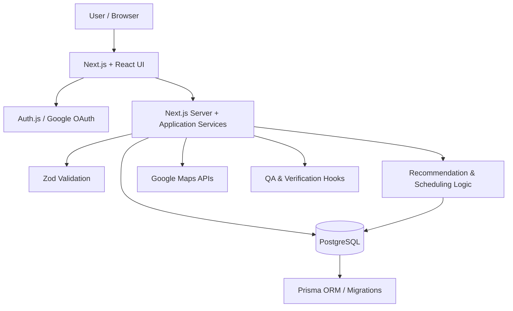

# TravleBuddy

AI-assisted travel planning software that turns user preferences, trip constraints, and location data into ranked recommendations and structured itineraries.

TravleBuddy is designed as more than a recommendation UI: it persists planning state, validates mutations, detects scheduling conflicts, integrates external location data, and includes a dedicated QA pipeline for exercising critical workflows before deployment.

## What It Does

- Collects trip preferences and planning constraints
- Produces ranked destination/activity suggestions
- Builds structured itinerary timelines
- Detects and resolves scheduling conflicts
- Persists trips and planning state in PostgreSQL
- Supports authenticated, user-specific data
- Integrates Google Maps data for location-aware planning
- Validates API inputs and state transitions
- Exercises critical flows with Vitest and Playwright

## Architecture



The application keeps UI concerns, planning logic, persistence, and verification separate so that recommendation and scheduling behavior can be tested independently from the interface.

## Tech Stack

| Layer | Technology | Role |
|---|---|---|
| Application | Next.js 16, React 19, TypeScript | Full-stack application and UI |
| Authentication | Auth.js / NextAuth | Google OAuth and authenticated user sessions |
| Database | PostgreSQL | Persistent relational trip and itinerary state |
| ORM | Prisma | Typed database access and schema migrations |
| Validation | Zod | Runtime request and payload validation |
| Maps | Google Maps JavaScript API | Location-aware planning and map integration |
| Testing | Vitest, Playwright | Unit/integration and end-to-end verification |
| QA tooling | Custom TypeScript CLI scripts | Deterministic validation, environment checks, staged QA |
| Styling | Tailwind CSS | Responsive interface styling |

## Core Planning Flow

A planning operation follows a guarded application flow rather than writing directly from UI state:

```text
User request
  -> authenticate session
  -> validate request payload
  -> load current trip/planning state
  -> compute ranked suggestions or itinerary changes
  -> check scheduling/logistics constraints
  -> persist validated state
  -> return updated plan to the client
```

This separation makes the planning logic easier to test and reduces the chance that malformed client input can directly corrupt persisted trip state.

## Engineering Decisions

### PostgreSQL for structured planning state

Trips, itinerary entries, user preferences, and revisions form strongly related data. A relational database provides explicit structure and supports safer multi-entity updates than treating the entire plan as an unstructured document.

**Tradeoff:** relational schemas require migration discipline as the product evolves, which is why migration validation is part of the project workflow.

### Prisma for typed persistence and migrations

Prisma keeps database access aligned with the TypeScript application while providing an explicit migration workflow. The repository separates schema generation, migration status checks, and deployment-oriented migration commands rather than hiding database changes inside application startup.

### Runtime validation at API boundaries

TypeScript protects compile-time assumptions, but external requests still arrive as runtime data. Zod is used to validate those boundaries before application logic operates on incoming state.

### Separate QA commands instead of one generic test script

The project includes dedicated commands for environment diagnosis, deterministic gates, seeding, cleanup, critical E2E flows, nightly E2E flows, production-safe verification, coverage, and staged QA.

That structure allows different levels of confidence to be exercised depending on the deployment context.

## Reliability & Testing

The repository includes both conventional automated tests and a larger QA toolchain.

### Vitest

Used for application/service-level verification and coverage.

```bash
npm test
npm run qa:coverage
```

### Playwright

Used for browser-level end-to-end verification of critical user workflows.

### QA pipeline

Available scripts include:

```bash
npm run qa:doctor
npm run qa:validate
npm run qa:seed
npm run qa:e2e:critical
npm run qa:e2e:nightly
npm run qa:e2e:production
npm run qa:gate
npm run qa:stage
```

The intent is to make environment correctness, test data, migration state, and critical application behavior explicit rather than relying only on a successful production build.

## Security & Data Integrity

Key safeguards represented in the repository include:

- authenticated user sessions
- server-side application logic for protected operations
- runtime request validation
- relational ownership between users and persisted trip data
- migration validation before database changes are deployed
- production-oriented verification commands that avoid treating live systems like disposable test environments

No client-side control should be considered a substitute for server-side authorization or validation.

## Project Structure

```text
.
├── docs/                  # Architecture, setup, phase, and CI/CD documentation
├── e2e/                   # Playwright end-to-end tests
├── prisma/                # Database schema and migrations
├── qa/                    # Deterministic QA tooling and staged verification
├── src/                   # Application code
├── .github/               # Repository automation / CI configuration
├── package.json
└── playwright.config.ts
```

The `docs/` directory also contains detailed setup and implementation notes, including authentication, Neon/PostgreSQL configuration, CI/CD, folder structure, and conversational-planning documentation.

## Engineering Challenges

### Scheduling state that changes over time

Travel plans are not static recommendations. Moving one item can create downstream timing conflicts. The application therefore models itinerary planning as persisted state that can be checked and revised rather than as a one-shot generated response.

### Safe application evolution

Because itinerary and user state are persistent, schema changes cannot be treated as local-only refactors. The project includes explicit migration status/deploy commands and protected QA flows to reduce deployment risk.

### Testing external-data workflows

Location-aware behavior depends on external services. The repository separates deterministic application checks from integration/E2E verification so core business logic can still be validated without making every test depend on live third-party responses.

## Running Locally

### Prerequisites

- Node.js
- PostgreSQL database
- Google OAuth credentials
- Google Maps API configuration

Use `.env.example` as the source of truth for required environment variables.

```bash
git clone https://github.com/gbw30/TravleBuddy.git
cd TravleBuddy
npm install
npm run prisma:generate
npm run dev
```

Open `http://localhost:3000`.

Before shipping changes, run the relevant verification commands:

```bash
npm run lint
npm run typecheck
npm test
npm run prisma:validate
npm run qa:gate
```

## What I Would Improve Next

- move long-running AI or external-data work behind asynchronous job processing where appropriate
- add richer observability around recommendation failures and external API latency
- expand load and concurrency testing for itinerary mutations
- add clearer public architecture visuals and product demo media
- continue separating deterministic planning logic from model-generated suggestions

## Additional Documentation

See [`docs/`](./docs) for implementation notes covering authentication, database setup, CI/CD, project phases, and conversational planning.
