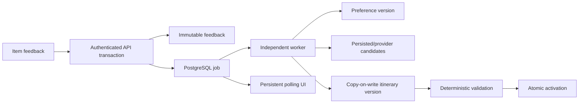

# TravleBuddy

TravleBuddy is an adaptive travel planner. A user can build a structured
itinerary, reject an item with a reason, and watch a durable background job
update a versioned preference profile and replace only the affected activity.
The system preserves the current itinerary until a validated successor commits.

This repository implements the first complete adaptive-planning vertical slice.
It is designed as a portfolio project that demonstrates product engineering,
transactional state management, background processing, concurrency control, and
provider isolation without pretending that credentialed cloud infrastructure is
already configured.

## Adaptive planning loop



The current policy is intentionally narrow:

- `TOO_EXPENSIVE` increases inferred price sensitivity and confidence by `0.10`,
  capped at `1.0`.
- Explicit signals outrank inferred signals.
- Other rejection reasons exclude the exact item without inventing a broader
  preference rule.
- Replacement ranking is deterministic by score, rating, provider ID, then
  name.
- A missing replacement activates the preference version and keeps the current
  itinerary.

## Architecture

- Next.js 16 App Router web application and ownership-gated route handlers.
- PostgreSQL and Prisma as the source of truth.
- Versioned preference profiles and copy-on-write itinerary versions.
- Immutable feedback identity and captured input versions.
- PostgreSQL-backed jobs using `FOR UPDATE SKIP LOCKED`.
- Standalone TypeScript worker with leases, heartbeats, retries, recovery, and
  stale-result checks.
- Google Places and deterministic mock providers behind one interface.
- Resilient client polling that resumes from persisted active jobs after reload.

Important code is organized under:

```text
src/features/adaptation/       preference policy, scoring, orchestration
src/features/jobs/             queue contracts, PostgreSQL store, runner
src/worker/                    standalone worker process
src/lib/providers/places/      mock and Google provider boundary
src/features/itinerary/        structured itinerary and conflict validation
src/components/recommendations behavior and presentational planning UI
prisma/migrations/             additive schema and data-preserving backfills
```

See [the product vision](docs/product-vision.md), [active
roadmap](docs/roadmap.md), and [architecture decisions](docs/architecture/) for
the design rationale.

## Fixed development topology

This project deliberately reuses its existing `qa` and `main` branches,
existing QA and production databases, and existing Vercel QA/production
targets. Do not create additional branches, worktrees, persistent databases,
Vercel projects, or preview environments unless the developer explicitly
approves the specific addition. Existing CI's temporary PostgreSQL service is
part of the current topology and remains allowed.

See [the standing operating constraints](docs/operating-constraints.md) before
changing development or deployment topology.

## Guarantees

- Feedback and its initial job/event are committed in the same transaction.
- HTTP retries use UUID operation IDs and the planning mutation ledger.
- Jobs execute at least once; version creation and activation are idempotent.
- Claims use a 30-second lease and a five-second heartbeat.
- Retry delays are 5, 20, and 60 seconds, with dead-lettering after the third
  failed attempt.
- A worker rechecks trip, preference, and parent-itinerary versions before
  persisting provider data and again before activation.
- An old worker cannot activate over newer trip state.
- The active itinerary is not superseded until its successor has been copied,
  validated, and activated in the same database transaction.
- API reads and mutations enforce trip ownership; provider raw metadata and job
  payloads are not exposed in client DTOs.
- Provider payloads, job payloads/results/events, progress text, and public
  history are bounded.

The queue makes an at-least-once guarantee, not an exactly-once claim.

## Local setup

Requirements:

- Node.js 24
- npm
- PostgreSQL 16-compatible database

Install dependencies and create a local environment file:

```powershell
npm ci
Copy-Item .env.example .env.local
```

For a deterministic no-cost demo, set:

```text
DATABASE_URL=postgresql://...
DIRECT_URL=postgresql://...
PLACE_PROVIDER_MODE=mock
QA_PROVIDER_MODE=mock
```

The web application also requires the Auth.js variables documented in
`.env.example`. The standalone worker requires only `DATABASE_URL`, optional
worker identity, and optional provider configuration.

Validate and apply migrations only to the currently authorized non-production
database. Do not create another database for this step:

```powershell
npm run prisma:validate
npm run prisma:generate
npm run db:deploy
```

Run the web and worker in separate terminals:

```powershell
npm run dev
```

```powershell
npm run worker:start
```

Process at most one available job:

```powershell
npm run worker:once
```

Never run migrations against an unverified production database. The protected
QA and deployment sequence is in
[docs/developer-finish-guide.md](docs/developer-finish-guide.md).

## Verification

Ordinary repository verification:

```powershell
npm run prisma:validate
npm run prisma:generate
npm run typecheck
npm run lint
npm run test
npm run build
```

The deterministic QA gate additionally validates migration status, coverage,
and the critical browser journey when an isolated writable QA database is
configured:

```powershell
npm run qa:gate
npm run qa:context
```

Mock provider mode is mandatory for automated tests and normal QA.

GitHub Actions keeps ordinary development lean: `CI` handles source integrity,
and `QA - Pull Request` handles the existing temporary PostgreSQL service,
focused integration tests, and critical Chromium journeys. Extended QA,
protected migrations, release QA, production smoke, and Codex audits run only
when manually requested or explicitly opted in.

The real PostgreSQL claim/recovery and existing-trip migration tests are opt-in
and refuse to run without the explicit URL of the existing authorized QA
database. The migration test uses and removes a uniquely named run-owned schema
inside that database:

```powershell
$env:ADAPTATION_TEST_DATABASE_URL = "postgresql://EXISTING_AUTHORIZED_QA_DATABASE"
npm run test -- src/features/jobs/postgres-store.integration.test.ts prisma/adaptive-planning-migration.integration.test.ts
```

## Demo flow

1. Create a trip, save preferences, select places, and build an itinerary.
2. Open the planning workspace and reject one itinerary item.
3. Choose `Too expensive` to demonstrate the supported inferred-preference
   policy.
4. Observe the persisted phases from feedback receipt through validation.
5. Confirm that only the affected item changes and a new itinerary version
   appears.
6. Reload during processing to show that polling resumes from database state.
7. Run the recovery and stale-result demonstrations from
   [docs/demo/adaptive-planning-demo.md](docs/demo/adaptive-planning-demo.md).

## Failure model

- A transient handler/provider failure schedules a bounded retry.
- A worker that stops heartbeating loses its lease; recovery marks the attempt
  abandoned and makes the job retryable or dead-lettered.
- A permanent configuration or validation failure is visible through the job
  API and UI with retry guidance.
- A newer trip or planning mutation supersedes an older job.
- No compatible candidate produces a successful `NO_REPLACEMENT` outcome; the
  preference update remains active and the prior itinerary stays active.
- `SIGTERM` stops new claims while the worker finishes its current execution or
  safely loses/releases the lease.

## Implemented versus externally unconfigured

Implemented in this repository:

- Schema, migration, backfill, services, routes, worker, mock provider, Google
  provider adapter, progress UI, tests, CI rules, Render blueprint, and runbooks.

Not configured by this repository:

- A Google Cloud project, billing, quota alerts, or API key.
- Vercel or Render environment variables and deployments.
- Protected QA/production migration execution.
- Final Figma styling and environment-backed release evidence.

Deliberately deferred:

- Routes API, Gemini planning, Redis, chat persistence, WebSockets/SSE, maps,
  booking/cancellation, job cancellation, advanced inferred-preference rules,
  and broad day/full-trip adaptation policies.

Dependency note (2026-07-26): `npm audit --omit=dev` reports one remaining
upstream advisory chain (`next` -> optional `sharp`, surfaced as three high
entries). The repository is on the latest available Next.js 16.2 patch and does
not use `next/image` or the Image Optimization API. Do not force an unsupported
`sharp` 0.35 override; update to the first official patched Next.js release and
rerun the full gate before deployment.

Follow [the developer finish guide](docs/developer-finish-guide.md) for the
credentialed steps that remain.
