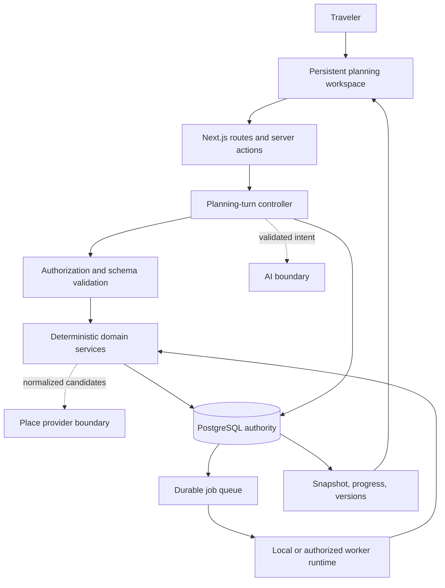

# TravleBuddy Architecture

Status: architecture
Authority: Target/current system boundaries and accepted-decision index
Related: [Target requirements](../requirements.md), [current implementation](../status/current-implementation.md), [roadmap](../roadmap.md)
Last reviewed: 2026-08-09

## Architecture principles

TravleBuddy uses a hybrid planning architecture. PostgreSQL is the durable source of truth. Backend services own authorization, validation, state transitions, deterministic ranking and scheduling, conflict derivation, and version activation. AI and place providers are bounded inputs: they may propose structured data, but validated backend logic decides what commits.

The current system is a Next.js application with Prisma/PostgreSQL persistence, Auth.js identity, deterministic recommendation services, and a PostgreSQL-backed adaptive job queue. The target adds durable conversation and structured intent while reusing the same authority boundaries.

## Planning-turn flow

1. The client sends a message or structured action with an operation ID and expected revision.
2. The backend checks authentication, ownership, revision, and payload bounds.
3. Optional AI extraction returns schema-validated intent; deterministic fallback remains available.
4. A bounded dispatcher applies structured changes and performs at most one authoritative rebuild for the turn.
5. PostgreSQL atomically records messages, mutations, versions, and replay output.
6. Long work is represented by durable jobs. A worker rechecks parent versions before activating results.
7. The client receives or polls a compact snapshot and renders persisted state.

## Current adaptive-command architecture

Plain removal is a bounded synchronous command: it records processed immutable feedback, applies any supported deterministic preference update, and activates a copy-on-write itinerary without the target item. Replacement requests write an immutable event and a `PROCESS_FEEDBACK_EVENT` job in the same transaction. The worker claims replacement jobs with `FOR UPDATE SKIP LOCKED`, renews a lease, applies retry policy, creates idempotent versions, and marks version-mismatched work `SUPERSEDED`. Neither command invalidates the current itinerary until a successor commits. See [ADR-006](adr-006-hybrid-adaptive-commands.md) and the [adaptive demo](../demo/adaptive-planning-demo.md).

The active free-first demonstration runs the web application on the existing Vercel QA target, uses the existing Neon QA database, and runs the worker locally. This deployment choice does not alter the durable queue design.

## Determinism and graceful degradation

Normalized inputs must produce stable ranking and scheduling. AI output never bypasses validation, and provider data never becomes authoritative without normalization. If AI or a live provider is unavailable, the product reports the limitation and uses supported deterministic behavior; it does not fabricate external results.

## Accepted ADRs

1. [ADR-001: Versioned planning state](adr-001-versioned-planning-state.md)
2. [ADR-002: PostgreSQL job queue](adr-002-postgresql-job-queue.md)
3. [ADR-003: Stale-result protection](adr-003-stale-result-protection.md)
4. [ADR-004: Resilient polling](adr-004-resilient-polling.md)
5. [ADR-005: Database-generated identifiers](adr-005-database-generated-identifiers.md)
6. [ADR-006: Hybrid adaptive commands](adr-006-hybrid-adaptive-commands.md)

Accepted ADRs record decisions at the time they were made. New architecture changes require a new or explicitly superseding decision; the index does not rewrite ADR history.
