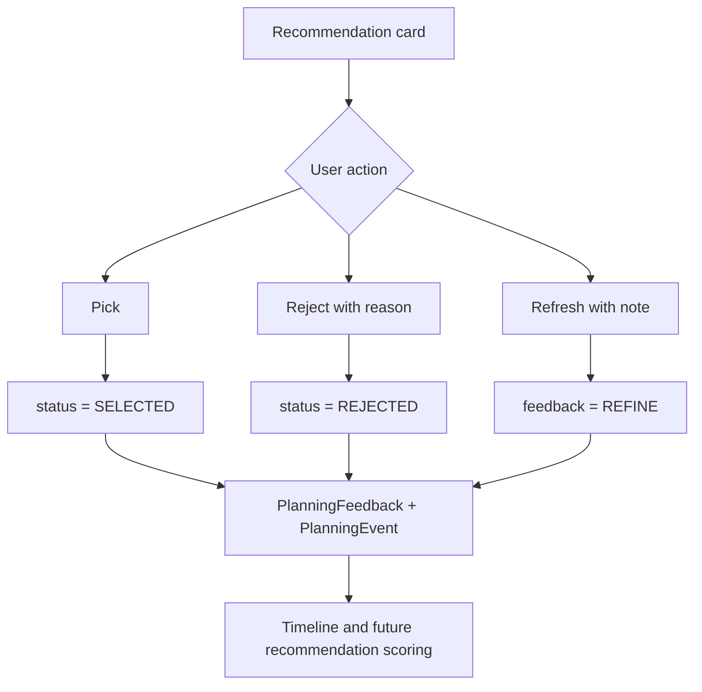
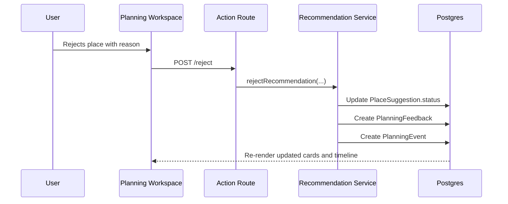

# Phase 7 Documentation

Status: historical
Authority: Preserved Phase 7 implementation evidence only
Related: [Canonical target](../../requirements.md), [current implementation](../../status/current-implementation.md), [active roadmap](../../roadmap.md)
Last reviewed: 2026-08-09

> **Historical document:** Do not use this document as current product requirements or implementation order. Phase-specific decisions and measurements describe their original implementation period.

This document records Stage 7 Recommendation Feedback and Itinerary Handoff decisions, implementation details, and validation notes.

It must not include secrets, API keys, database URLs, OAuth credentials, `.env` values, or sensitive terminal output.

---

## Phase Goal

Complete the deterministic recommendation feedback loop inside the existing planning workspace:

- Users can reject recommendations with structured reasons and optional notes.
- Users can remove selected recommendations or already-decided anchors without rejecting them.
- Users can open a place-action log to recover from accepted, rejected, or removed-place misclicks.
- Rejection feedback affects future mock recommendation batches.
- User-facing planning events appear in a compact timeline.
- Selected places become a clear handoff input for the future Stage 8 itinerary builder.

Stage 7 intentionally keeps the primary UX at:

```text
/trips/[tripId]/planning
```

The old separate `/suggestions` page is superseded by the unified planning workspace.

---

## Product Decisions

- Postgres remains the source of truth for suggestions, feedback, and timeline events.
- Stage 7 uses the existing soft status model:
  - `PENDING` means available but not currently selected.
  - `SELECTED` means visible in the live plan preview and eligible for Stage 8 itinerary building.
  - `REJECTED` means excluded from active recommendation cards and used by the feedback penalty policy.
- Removing a place is not the same as rejecting it:
  - remove sets `PlaceSuggestion.status = PENDING`
  - reject sets `PlaceSuggestion.status = REJECTED`
- The place-action log is backed by `PlanningFeedback`, not temporary UI state, so accepted, rejected, and removed locations remain visible after reload.
- Removed and rejected locations can be picked again from the log through the existing select action.
- Stage 7 exposes only recommendation-rejection reasons:
  - `NOT_INTERESTED`
  - `TOO_EXPENSIVE`
  - `TOO_FAR`
  - `WRONG_VIBE`
  - `ALREADY_BEEN_THERE`
  - `OTHER`
- `TOO_BUSY`, `TOO_SLOW`, and `GOOD_MATCH` remain available for later itinerary/conflict feedback.
- Every major select, reject, remove, and refresh action writes structured `PlanningFeedback`.
- Major user actions also write visible `PlanningEvent` rows for the compact planning timeline.
- A separate selection model is deferred until the product needs itinerary versions, collaboration, or saved/maybe lists.



---

## Implemented Interfaces

Created API routes:

```text
POST /api/trips/[tripId]/recommendations/[suggestionId]/reject
POST /api/trips/[tripId]/recommendations/[suggestionId]/deselect
```

Updated existing planning behavior:

- Selected and rejected actions write visible timeline events.
- Refresh notes write visible user feedback events through the existing planning-message path.
- `GET /api/trips/[tripId]/recommendations?topic=...` and planning workspace data exclude rejected cards from active recommendation lists.
- Future recommendation generation excludes exact rejected mock places and applies deterministic penalties from rejection reasons.

---

## Implementation Notes

- Added a versioned deterministic feedback policy module for rejection penalties.
- Added reject/deselect service functions that preserve history rather than deleting rows.
- Added inline reject controls and selected-place remove controls to the planning workspace.
- Added compact planning timeline rendering from visible `PlanningEvent` rows.
- Added a collapsible place-action log for accepted, rejected, and removed places.
- Added soft itinerary handoff copy when at least one selected place exists.
- Stage 7 does not call Gemini, Google Places, Google Routes, Google Maps, Redis, or an itinerary builder.



---

## Validation Plan

Stage 7 verification should include:

```text
npm.cmd run test
npm.cmd run typecheck
npm.cmd run lint
npm.cmd run prisma:validate
npm.cmd run build
npm.cmd run dev
```

`npm.cmd run dev` is included as a local smoke check. Start it long enough to confirm the Next.js dev server boots, then stop it before finishing the phase.

## Validation Results

Focused Stage 7 tests:

```text
npm.cmd run test -- src/features/recommendations/feedback-policy.test.ts src/features/recommendations/scoring.test.ts src/features/recommendations/service.test.ts 'src/app/api/trips/[tripId]/recommendations/[suggestionId]/reject/route.test.ts' 'src/app/api/trips/[tripId]/recommendations/[suggestionId]/deselect/route.test.ts' src/components/recommendations/planning-workspace.test.tsx
```

Result:

- 6 test files pass.
- 19 tests pass.

Full verification:

```text
npm.cmd run test
npm.cmd run typecheck
npm.cmd run lint
npm.cmd run prisma:validate
npm.cmd run build
npm.cmd run dev
```

Results:

- Full Vitest suite passes: 36 test files and 149 tests.
- TypeScript passes.
- ESLint passes.
- Prisma schema validation passes.
- The first production build generated Prisma Client but failed because the sandbox could not fetch Google Fonts for `next/font`.
- The production build passed after rerunning with network permission for the font fetch.
- The successful build generated the new reject and deselect recommendation API routes.
- `npm.cmd run dev` booted successfully on `http://127.0.0.1:3018` and was stopped after the smoke check.
