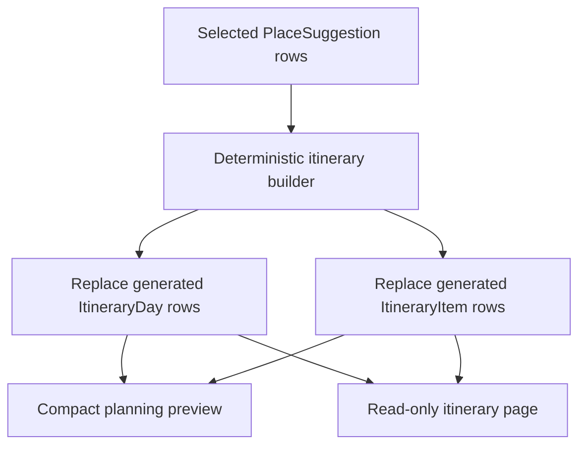
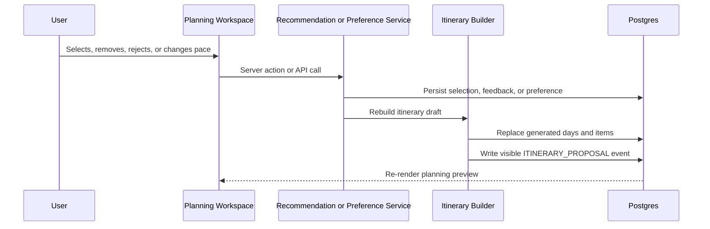

# Phase 8 Documentation

This document records Stage 8 Basic Itinerary Builder decisions, implementation details, and validation notes.

It must not include secrets, API keys, database URLs, OAuth credentials, `.env` values, or sensitive terminal output.

---

## Phase Goal

Turn selected places from the Stage 7 planning loop into a persistent, deterministic itinerary draft.

The primary user workflow remains:

```text
/trips/[tripId]/planning
```

Stage 8 adds a compact itinerary preview inside that workspace and a read-only expanded page:

```text
/trips/[tripId]/itinerary
```

---

## Product Decisions

- Postgres remains the source of truth.
- Itinerary drafts are generated output, not manually edited schedules.
- The builder reads `PlaceSuggestion` rows where `status = SELECTED`.
- Rebuilds replace generated `ItineraryDay` and `ItineraryItem` rows for the trip.
- Trips with no selected places clear any generated itinerary rows and return a clear `no_selected_places` status.
- Hotels are placed at the start of Day 1 as base/check-in anchors.
- Non-hotel places are distributed by exact pace capacity:
  - `RELAXED`: 3 non-hotel items per day
  - `BALANCED`: 4 non-hotel items per day
  - `PACKED`: 6 non-hotel items per day
- Ordering is deterministic:
  - hotels first on Day 1
  - then `ATTRACTION`, `LANDMARK`, `ACTIVITY`, `RESTAURANT`, `ENTERTAINMENT`
  - within category, higher score first
- Start/end clock times remain `null`.
- Manual edits, reorder, conflict detection, route duration, maps, export, Gemini, Google APIs, and Redis remain later-stage work.



---

## Implemented Interfaces

```text
GET  /api/trips/[tripId]/itinerary
POST /api/trips/[tripId]/itinerary/build
```

- `GET` returns persisted itinerary days/items for an authenticated owner.
- `POST` explicitly rebuilds from current selected places.
- Both routes require authentication and trip ownership.
- Both routes reject archived, missing, or not-planning-ready trips.
- `POST` returns `no_selected_places` when there are no selected places.

---

## Auto-Rebuild Triggers

The itinerary draft rebuilds after:

- selecting a recommendation
- adding an already-decided place
- deselecting/removing a selected place
- rejecting a selected place
- changing pace through natural-language planning feedback
- changing pace through saved trip preferences



---

## User Stories

- As a traveler, I can see a day-by-day itinerary draft appear as I select places.
- As a traveler, I can remove a selected place and see the itinerary update automatically.
- As a traveler, I can change my trip pace and see the itinerary redistribute places.
- As a traveler, I can see daily item counts and estimated costs while planning.
- As a traveler, I can open a read-only itinerary page for a clearer full-trip view.
- As an engineer, I can rebuild an itinerary deterministically from selected places and pace.
- As an engineer, I can test itinerary grouping without external APIs.

---

## Validation Plan

Stage 8 verification should include:

```text
npm.cmd run test
npm.cmd run typecheck
npm.cmd run lint
npm.cmd run prisma:validate
npm.cmd run build
npm.cmd run dev
```

`npm.cmd run dev` is included as a local smoke check. Start it long enough to confirm the Next.js dev server boots, then stop it before finishing the phase.

## Validation Results

Focused Stage 8 tests:

```text
npm.cmd run test -- src/features/itinerary/builder.test.ts 'src/app/api/trips/[tripId]/itinerary/route.test.ts' 'src/app/api/trips/[tripId]/itinerary/build/route.test.ts'
npm.cmd run test -- src/features/recommendations/service.test.ts src/features/preferences/actions.test.ts
npm.cmd run test -- src/components/recommendations/planning-workspace.test.tsx 'src/app/(dashboard)/trips/[tripId]/itinerary/page.test.tsx' 'src/app/(dashboard)/trips/[tripId]/planning/page.test.tsx'
```

Result:

- 9 focused files passed.

Full verification:

```text
npm.cmd run test
npm.cmd run typecheck
npm.cmd run lint
npm.cmd run prisma:validate
npm.cmd run build
npm.cmd run dev -- --hostname 127.0.0.1 --port 3020
```

Results:

- Full Vitest suite passed: 40 test files and 165 tests.
- TypeScript passed.
- ESLint passed.
- Prisma schema validation passed.
- Production build passed and listed the new itinerary API routes and read-only itinerary page.
- `npm.cmd run dev` booted successfully on `http://127.0.0.1:3020`; the command timed out intentionally after the server reported ready so no dev server was left running.
