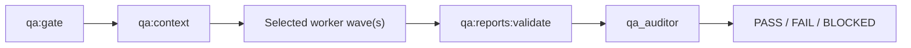

# TravleBuddy QA Agent System

## Architecture

The root coordinator owns environment safety, deterministic execution, agent selection, bounded waves, and the final user-facing handoff. `.codex/config.toml` sets `max_threads = 4` and `max_depth = 1`, so the root can run three direct workers without recursive fan-out.

Agents inherit the coordinator model and sandbox. Local workspace-write runs can write only gitignored evidence and run-owned fixtures. Codex Action jobs use the currently supported `sandbox: read-only` input; those agents return report content in their final response instead of treating artifact-write denial as a blocker.

## Roles and reasoning

| Agent | Effort | Responsibility |
|---|---:|---|
| `qa_baseline` | medium | Audit deterministic evidence and missing test inventory; do not rerun completed checks. |
| `qa_journeys` | medium | User journeys, navigation, persistence, browser state, and accessibility. |
| `qa_constraints` | high | Validation boundaries, combinations, domain invariants, itinerary, and conflicts. |
| `qa_security_concurrency` | high | Auth, ownership, mutation authorization, replay, stale revisions, and races. |
| `qa_resilience_production` | high | Provider failure, recovery, configuration, performance evidence, and production risk. |
| `qa_auditor` | high | Evidence validation, primary-evidence review, deduplication, and final gate decision. |

No agent pins a model or sandbox. Prompts contain only role-specific instructions and reference the shared policy plus a generated bundle.

## Routing and waves

PRs always use baseline and auditor. UI/browser changes add journeys; domain/validation changes add constraints; auth/API/action changes add security; environment/provider/deployment changes add resilience. Requirement, feature-state, scenario-contract, migration, agent-system, unknown, or three-domain changes select the full team. A missing PR base also selects the full team.

Nightly, full, stage, and release runs use:

1. Baseline, journeys, and constraints.
2. Security/concurrency and resilience/production.
3. Auditor only, after worker-report validation.

Production uses read-only security and resilience review followed by the auditor. The coordinator continues independent workers when one role is blocked.

## Evidence flow

`qa:context` snapshots each agent’s assigned scenarios, blocking scenario IDs, relevant features, source/documentation/test paths, permissions, evidence inputs, and output location. Bundles are limited to 32 KiB and contain references rather than source or log contents.

Workers emit the typed report contract. `qa:reports:validate` verifies context/report chronology; run, agent, commit, target, assignment, and verdict consistency; and unchanged tracked-state fingerprints. Source citations remain distinct from produced evidence, which must stay inside the owning worker directory. Stage 0 revision proof includes operation ordering, mutation fingerprint, revisions, and durable deltas. Validated performance proof requires cold-run exclusion, 20 warm samples, percentile method, p50/p95/max, query and payload p95, and separate provider latency.

The auditor reads summaries first. It opens every failed, blocked, flaky, confirmed, security, or production-risk item, contradictions and missing evidence, plus one required P0 sample per selected worker. Successful bulk logs and media remain unloaded.

## Discovery and troubleshooting

Custom agents live in `.codex/agents/` and are checked by `npm run qa:validate`. The validator enforces the six expected names, reasoning settings, parent inheritance, prompt limits, referenced paths, context limits, orchestration configuration, workflow syntax, committed prompts, read-only Codex jobs, and the preserved Next.js rule.

- Context selects all agents unexpectedly: inspect `selectionReasons`; the usual causes are missing `QA_BASE_SHA`, an unknown path, a requirement/contract change, or three affected domains.
- Worker report is missing/invalid: inspect `summary/run-summary.json`; do not bypass it before audit.
- CI agent cannot write a report: confirm its bundle says `outputMode: final-response`.
- Environment cannot be proven safe: return `BLOCKED`; never change the fingerprint or write flag to force execution.
